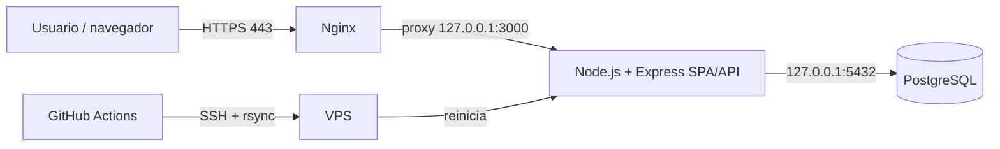

# Informe técnico: To-Do List con CI/CD

## 1. Diseño de infraestructura

La solución usa un VPS Linux (Ubuntu 24.04), con la aplicación y la base de datos en el mismo servidor para un entorno académico. Nginx es el único servicio público: recibe HTTP/HTTPS y reenvía las peticiones a Express en la interfaz local. PostgreSQL sólo escucha localmente.

| Componente | Función | Puerto accesible |
| --- | --- | --- |
| Nginx | Proxy inverso, terminación TLS y servidor web | 80/443 |
| Node.js + Express | Sirve SPA y API CRUD | Sólo 127.0.0.1:3000 |
| PostgreSQL | Persiste las tareas | Sólo 127.0.0.1:5432 |
| GitHub Actions | Validación y despliegue automático | SSH 22 al VPS |

## 2. Provisionamiento y configuración

Se aprovisiona un VPS con Ubuntu, se actualizan paquetes y se instalan Nginx, PostgreSQL, Node.js, rsync y UFW. Se crea el usuario de sistema `todoapp`, sin sesión interactiva, propietario de `/var/www/todo-cicd`. La aplicación se ejecuta como dicho usuario mediante `systemd`; nunca como `root`.

En PostgreSQL se crean el rol `todo_user` y la base `todo_db`. La contraseña y URL de conexión se almacenan exclusivamente en `/var/www/todo-cicd/.env`, con permisos `600`. El archivo `database/init.sql` crea la tabla `tasks`, validación de título y un trigger para conservar `updated_at`.

Nginx publica el servicio y envía el tráfico a Express en `127.0.0.1:3000`. El archivo `todo-cicd.service` activa reinicio automático ante fallo y limita privilegios del proceso. Los comandos reproducibles se encuentran en `deploy/README.md`.

## 3. Pipeline CI/CD

Al hacer `push` a `main`, GitHub Actions ejecuta el workflow `.github/workflows/deploy.yml`.

1. Descarga el código, instala dependencias con `npm ci` y valida la sintaxis con `npm run check`.
2. Si la validación termina correctamente, carga la llave SSH desde GitHub Secrets y verifica el host.
3. Sincroniza el código con `rsync`; excluye `.env`, Git, dependencias y artefactos locales, preservando los secretos del VPS.
4. Ejecuta en remoto el script controlado `deploy-todo.sh`, que instala dependencias de producción, valida el código y reinicia `todo-cicd`.

El workflow usa un grupo de concurrencia para impedir despliegues simultáneos. Los secretos requeridos son `SSH_PRIVATE_KEY`, `SERVER_HOST`, `SERVER_USER` y `DEPLOY_PATH`; ninguno se guarda en el repositorio.

## 4. Mantenimiento y seguridad

La estrategia de respaldo utiliza `pg_dump` en formato personalizado cada día a las 02:00. Los respaldos se almacenan con permisos `700` en `/var/backups/todo-cicd` y el script conserva 14 días. Para restaurar, se crea o vacía la base destino y se usa `pg_restore -U todo_user -d todo_db archivo.dump`. Como mejora, se deben copiar los respaldos cifrados a almacenamiento externo; guardar sólo copias en el VPS no protege de una pérdida total del servidor.

UFW aplica política de denegar entradas por defecto. Sólo se permiten SSH (22), HTTP (80) y HTTPS (443); los puertos 3000 y 5432 no son públicos. El acceso SSH se realiza mediante llaves Ed25519, se deshabilita el inicio de sesión directo de root y se mantienen actualizaciones periódicas del sistema.

## Evidencia a adjuntar

- Captura de `systemctl status todo-cicd` y `systemctl status nginx`.
- Captura de la SPA realizando altas, edición, borrado y filtro.
- Captura del workflow de GitHub Actions completado.
- Salida de `sudo ufw status numbered`.
- Registro de un respaldo y, preferiblemente, una restauración de prueba.
